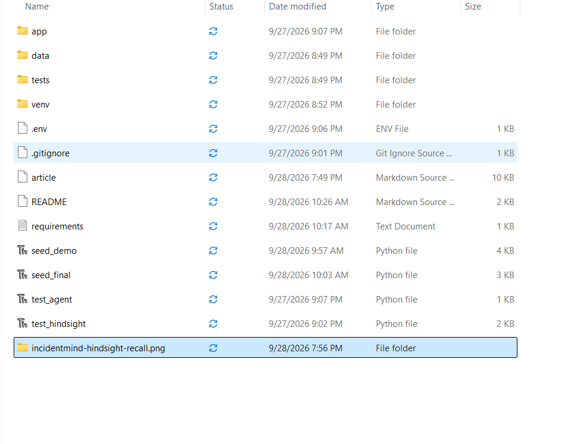
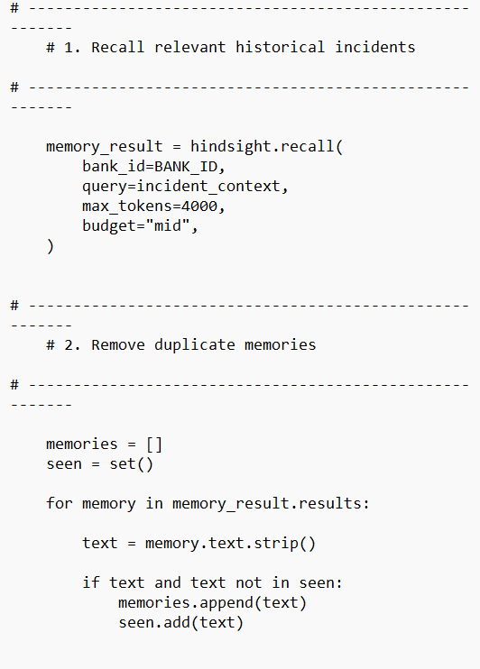
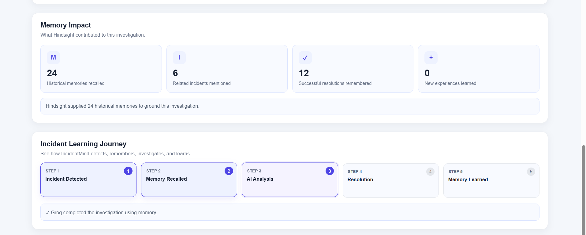

# How Hindsight Turned Incident Resolutions Into Searchable Memory

An incident report is useful while the team is fixing the problem. It becomes much more valuable when the next investigation can find it, understand what was tried, and see whether that action worked. That is the loop I built into IncidentMind: an incoming incident prompts a Hindsight recall, recalled experience informs Groq’s investigation, an engineer records the resolution, and IncidentMind retains that outcome in Hindsight for future recall.

The system does not ask a model to remember incidents across unrelated requests. It stores incident records in a Hindsight memory bank and retrieves relevant history when a new investigation arrives.

## One incident, one memory loop

IncidentMind is a Python application with a FastAPI API and a browser interface in `app/static/index.html`. The `/investigate` endpoint accepts an incident ID, service, severity, description, and optional report time, then passes those fields to `investigate_incident` in `app/services/agent_service.py`. That function builds context, calls Hindsight, prepares a prompt, and requests Groq analysis.

The engineer still owns the resolution. The `/resolve` endpoint accepts incident details, the attempted resolution, a success flag, and an optional engineer note. `record_resolution` formats these as a learning record and retains it in Hindsight for a later investigation.

The flow is simple to describe:

`incident → Hindsight recall → historical experience → Groq reasoning → engineer resolution → Hindsight retain → future recall`

Retrieval and learning are distinct operations: during investigation, the system asks what prior material might be relevant; after the engineer records an outcome, it stores that experience. Hindsight is the persistent memory layer between investigations, while Groq reasons over the current incident and recalled context.

## Why I put Hindsight in the middle

Incident response narrows hypotheses from incomplete symptoms. A latency spike after a release could come from a query, a connection leak, or another change. A previous case can point the engineer toward useful checks.

IncidentMind uses [Hindsight](https://github.com/vectorize-io/hindsight) to make those records available to later requests. In `app/services/agent_service.py`, the Hindsight client reads its URL and API key from `HINDSIGHT_API_URL` and `HINDSIGHT_API_KEY`; Groq reads `GROQ_API_KEY`. The runtime service sets `BANK_ID = "incidentmind_final"` and `MODEL = "openai/gpt-oss-120b"`.

The Hindsight [documentation](https://hindsight.vectorize.io/) describes the client and memory API. IncidentMind uses its `recall` and `retain` operations as parts of one workflow. This is the broader idea of [agent memory from Vectorize](https://vectorize.io/what-is-agent-memory): information from earlier interactions can inform a later one.

## Recall starts with the full incident

`investigate_incident` formats the current event into `incident_context`, including the incident ID, service, severity, report time, and description. It queries with all of that context rather than the description alone.

The call asks Hindsight for up to 4,000 tokens with a `mid` budget:

```python
memory_result = hindsight.recall(
    bank_id=BANK_ID,
    query=incident_context,
    max_tokens=4000,
    budget="mid",
)
```

The result texts become `memory_context`, separated by blank lines. With no usable results, the prompt includes `No relevant historical incidents found.`



## Deduplication is a small boundary check

I added a short pass between recall and prompt construction. It strips surrounding whitespace, skips empty strings, and preserves the first copy of each exact text in a list, using a set to track what has already appeared:

```python
memories = []
seen = set()

for memory in memory_result.results:
    text = memory.text.strip()
    if text and text not in seen:
        memories.append(text)
        seen.add(text)
```

Identical returned records add no distinct evidence and consume context. This is exact-text deduplication after trimming whitespace; it will not detect paraphrases or determine whether similar records describe the same event. The filter removes obvious repeats, not memory consolidation.

The investigation function also returns the filtered list and its length as `memory_count`, so the interface can show the historical texts and count beside the analysis.



## Groq reasons over history, not instead of it

The prompt contains the current incident and unique recalled memories. It requests six sections: incident summary, relevant historical incidents, possible root causes, recommended investigation and resolution, and why historical memory matters.

The prompt also sets useful boundaries. It says to distinguish facts from hypotheses, not to claim a root cause without evidence, not to invent logs or metrics, and to treat historical incidents as evidence rather than proof. Then the configured Groq model receives the prompt:

```python
response = groq.chat.completions.create(
    model=MODEL,
    messages=[
        {"role": "system", "content": "You are a careful production incident response engineer."},
        {"role": "user", "content": prompt},
    ],
    temperature=0.2,
    max_completion_tokens=1500,
)
```

Hindsight provides potentially relevant history; the prompt tells Groq to use it cautiously. A past fix can guide investigation, but the current incident still needs current evidence. The function returns the analysis alongside incident fields, memories, and count.

## The engineer closes the loop

The loop is not complete when Groq writes an investigation. It closes when an engineer records what they tried and whether it worked. `record_resolution` creates a structured text record with the incident ID, service, severity, report time, description, resolution attempt, outcome, engineer note, and a general learning statement. If no note is supplied, it records `No additional note provided.`

The status is converted to `SUCCESSFUL` or `UNSUCCESSFUL`, and the resulting record is sent to the same Hindsight bank:

```python
hindsight.retain(
    bank_id=BANK_ID,
    content=memory.strip(),
)
```

Recording unsuccessful attempts means history can describe outcomes, not only fixes. The code retains both statuses but adds no recall ranking by success; the prompt only says to prefer successful resolutions when evidence supports them.



## Before and after: a representative seeded example

The seed scripts contain representative test incidents, not verified production history. `seed_final.py` includes `INC-2041`, a critical `payments-api` case with 503 errors after deployment, attributed to a connection leak exhausting the pool. The recorded successful resolution is rollback and a fix to connection handling. `INC-2315` describes payment latency and intermittent 503s attributed to excessive scans from a new query, with query optimization and an index as the resolution.

Before memory is available, a report of payment latency and 503s reaches Groq without historical context. Once the seed records are retained in the configured bank, a similar report can cause Hindsight to return examples. IncidentMind filters exact duplicates and asks Groq to suggest checks: connection-pool metrics and query plans, with both causes treated as hypotheses to validate.

If the engineer finds a different cause, `/resolve` retains it too. Later recall can include it alongside the examples. This describes the code path and representative seed data, not a real diagnosis or measured improvement.

## Lessons and limitations

I took a few practical lessons from building this loop:

1. **Make memory flow visible.** The code keeps recall, prompt assembly, reasoning, and retain as separate steps, which makes it easier to inspect what context influenced an analysis.
2. **Preserve outcomes with the resolution.** A fix without its success status or engineer note is less useful to a future investigation.
3. **Use past incidents as leads.** Similar symptoms can suggest checks, but they cannot establish today’s root cause.
4. **Keep duplicate handling conservative.** Exact text equality after trimming is predictable. More aggressive matching could merge distinct incidents, so it would need evidence and tests.
5. **Be explicit when memory is absent.** A clear fallback lets the reasoning prompt distinguish an empty recall from an omitted section.

The repository has no automated coverage for recall ranking, duplicate handling, or prompt contents. Deduplication misses semantic redundancy, and seed/manual scripts are demo scaffolding, not production evidence. The service has no explicit recovery for Hindsight or Groq failures; `/health` returns configured labels rather than testing live connectivity. The runtime service uses `incidentmind_final`, while seed scripts also contain other bank IDs, including `incidentmind_demo` and `incidentmind` in the manual test script. These are repository and test-data configuration details; the example data must use the runtime bank ID to be available to the service.

## Conclusion

IncidentMind turns an engineer’s resolution into searchable memory by retaining a structured outcome in Hindsight, then recalling history for a later investigation. Groq reasons over that context alongside the current incident, with instructions to distinguish evidence from confirmed facts. Exact-text deduplication is a supporting safeguard that removes empty and repeated strings before the model sees them.

This is a memory workflow with an engineer in the loop, not an autonomous responder or a measured production improvement: retain what happened, recall it when relevant, and keep the evidence visible enough to challenge.
